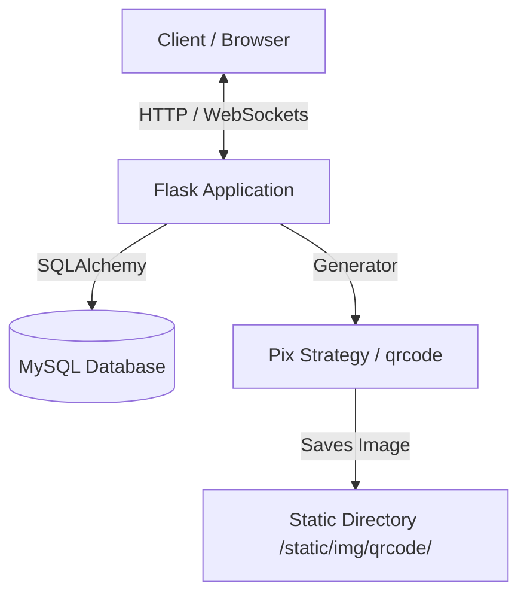
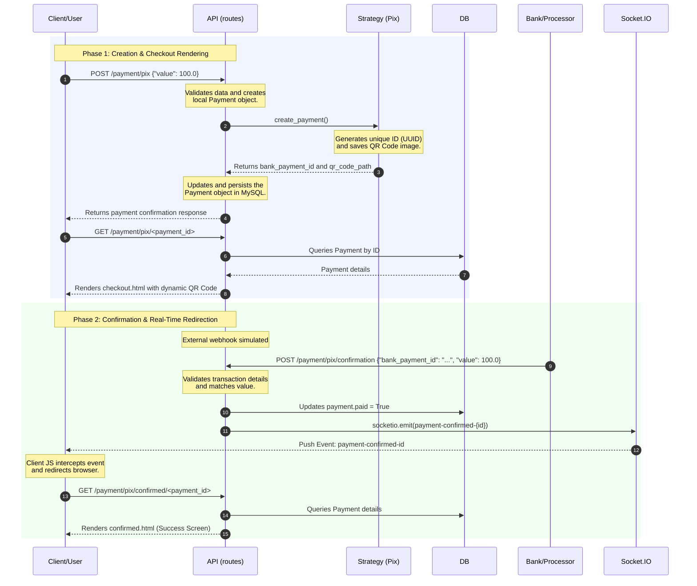

# System Architecture

This document describes the architecture of the **Payment-API** project, detailing design patterns, the data structure, communication flows, and technical decisions implemented.

---

## 1. System Overview

**Payment-API** is a backend service for processing and checking out payments using the **Pix** payment method. The system exposes HTTP endpoints to create and retrieve transactions, dynamically generates QR Codes for payment, and uses real-time bidirectional communication to synchronize status with the frontend.

---

## 2. Technology Stack

The system is built using **Python** and the **Flask** microframework ecosystem:

- **Flask**: Web framework used to handle routing and application flow control.
- **Flask-SQLAlchemy**: Object-Relational Mapping (ORM) library for persisting data in a relational database.
- **Flask-SocketIO**: WebSocket support enabling real-time communication between the client and server.
- **MySQL**: Relational database used to persist payment transactions.
- **qrcode (Pillow)**: Libraries used to generate physical QR Code images.

---

## 3. Design Patterns

The project is structured following software design best practices to ensure scalability and readability:

### 3.1. Application Factory Pattern
The creation of the Flask application and initialization of its extensions are centralized within the [create_app](file:///home/jhonny/Git/Payment-API/src/app/factory.py#L9) function in the [factory.py](file:///home/jhonny/Git/Payment-API/src/app/factory.py) module. This prevents circular dependencies and simplifies configuration across multiple environments (development, testing, production).

### 3.2. Strategy Pattern
The logic for generating and integrating different payment methods is encapsulated using the Strategy pattern. The [Pix](file:///home/jhonny/Git/Payment-API/src/app/strategies/pix.py#L6) class in [pix.py](file:///home/jhonny/Git/Payment-API/src/app/strategies/pix.py) implements the payment creation interface. This approach allows adding new payment methods (e.g., Credit Card, PicPay) without altering the main routing flow of the system.

### 3.3. Blueprint Pattern
Routes are organized modularly using Blueprints. The [schemas.py](file:///home/jhonny/Git/Payment-API/src/app/payments/schemas.py) module defines the `payments_bp` blueprint, grouping all payment-related endpoints together to allow logical separation of routing concerns.

---

## 4. Data Model

Payment information persistence is structured into a single table represented by the [Payment](file:///home/jhonny/Git/Payment-API/src/app/models.py#L6) model class defined in [models.py](file:///home/jhonny/Git/Payment-API/src/app/models.py).

### `Payment` Entity (`payments` table)

| Attribute | Data Type | Description |
| :--- | :--- | :--- |
| `id` | `Integer` (PK) | Unique identifier of the transaction in the database. |
| `value` | `Float` | Monetary value of the payment (in BRL / R$). |
| `paid` | `Boolean` | Flag indicating whether the payment has been completed (Default: `False`). |
| `bank_payment_id` | `String(200)` | ID generated by the external bank/payment processor. |
| `qr_code` | `String(200)` | File name or content identifier of the generated QR Code. |
| `expiration_date` | `DateTime` | Expiration date and time limit for executing the payment. |

---

## 5. Real-Time Communication

To update the payment status on the user's screen reactively (without relying on client-side polling), the `Flask-SocketIO` library was integrated:

1. When the client accesses the checkout page ([checkout.html](file:///home/jhonny/Git/Payment-API/src/app/templates/payments/checkout.html)), a WebSocket channel is established using the Socket.IO client library.
2. The server monitors connection events from new clients via the [handle_connect](file:///home/jhonny/Git/Payment-API/src/app/payments/events.py#L4) handler configured in the [events.py](file:///home/jhonny/Git/Payment-API/src/app/payments/events.py) module.
3. Upon receiving a payment confirmation webhook from the external processor, the system can emit a WebSocket event notifying the frontend to update the order status in real time.

---

## 6. Execution Flow (Full Payment Lifecycle)

The diagram below describes the sequence of events from the initial payment request, through the checkout page rendering, up to the bank confirmation webhook, real-time WebSocket notification, and automatic redirection to the success screen:

